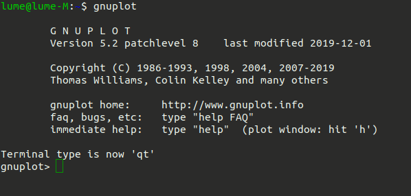
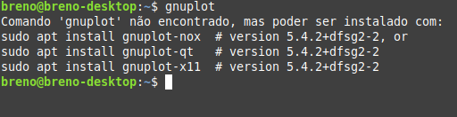

# Gnuplot tutorial

O Gnuplot é um software utilitário de terminal para geração de gráficos 2D e 3D. Podendo ser utilizado em diferentes plataformas: Windows, Linux, Mac, Android etc. 

Os gráficos podem ser gerados diretamente via terminal, por um arquivo externo e até mesmo através de um executável em C. 

## Tópicos
1. [Instalação do Gnuplot](#instalação-do-gnuplot)
2. [Alguns comandos básicos do gnuplot](#alguns-comandos-básicos-do-gnuplot)
3. [Gnuplot em C](#gnuplot-em-c)
4. [Como enviar informações para o gnuplot?](#como-enviar-informações-para-o-gnuplot)
   4.1 [Enviando as coordenadas](#enviando-as-coordenadas)
   4.2 [Mudando a Ordem com o using](#mudando-a-ordem-com-o-using)
5. [Estilizando o Gráfico: Pontos x Linhas](#estilizando-o-gráfico-pontos-x-linhas)
6. [Resumo](#resumo)
7. [Tarefa](#tarefa)

## Instalação do Gnuplot
Para confirmar se o programa do Gnuplot está instalado na sua máquina execute o comando abaixo no seu terminal:

````bash
gnuplot

````

Caso o seu retorno seja algo parecido com isso, significa que a instalação já foi realizada:



Em caso contrário, execute o comando sugerido no terminal:



 O texto `gnuplot>` no início da linha indica que o gnuplot está pronto para receber comandos. Por exemplo: 

````bash
                                                                plot cos(x)

````

## Alguns comandos básicos do gnuplot

| Descrição           | Comando              | 
|--------------------------|------------------------------|
| **Nomear eixos**         | gnuplot> set xlabel "eixo X" |                    
| **Inserir título**       | gnuplot> set title "meu título"  | 
| **Inserir grade**        | gnuplot> set grid                        |
| **Gerar gráfico 2D**       | gnuplot> plot x | 
| **Gerar gráfico 3D**       | gnuplot> splot x*y                          | 
| **Encerra gnuplot**         |  gnuplot> quit               | 

Obs: Para executar as alteracões realizadas com set é necessário usar o comando `gnuplot> replot` para que aconteça uma atualização. Algo parecido vale para caso em que se deseja gerar dois ou mais gráficos ao mesmo tempo. Após o comando plot ou splot o próximo gráfico exige o uso do replot.

## Gnuplot em C

Por ser um software independente (um programa instalado no seu PC) o C não importa uma biblioteca específica para usa-lo, ocorre a  utilização da própria stdio.h para fazer a abertura de um "cano/tubulação" (pipe) que através do seu código C envia comandos de texto que o Gnuplot executa e renderiza em tempo real.


A manipulação do Gnuplot em C é quase idêntica à manipulação de um arquivo comum, mudando apenas as funções de sistema:


| Operação           | Arquivo Comum (stdio.h)              | Gnuplot (Pipe)  |
|--------------------------|------------------------------|--------------------------|
| **Declaração**         |FILE *arquivo; |                    FILE *gnuplot_pipe; |
| **Abertura**       | fopen("arquivo.txt", "w");  | popen("gnuplot", "modo"); |
| **Escrita**        | fprintf(arquivo, "texto");| fprintf(gnuplot_pipe, "plot..."); |
| **Fechamento**       | fclose(arquivo); | pclose(gnuplot_pipe);|

O comando de abertura `popen` (Pipe Open) cria um canal de comunicação entre seu programa e o Gnuplot.
- O argumento "gnuplot" é o nome do executável que o sistema operacional vai procurar e rodar em segundo plano.
- O “modo” representa a operação que se deseja efetuar e define a direção do fluxo de dados entre o seu programa e o Gnuplot. Na prática, existem dois modos principais: 

| Modo           | Descrição           | Exemplo  |
|--------------------------|------------------------------|--------------------------|
| **"w"(Write)** |Abre o Gnuplot e permite que o seu programa C envie comandos | Enviar comandos como `set title`, `plot 'arquivo.txt'` ou os próprios dados via `plot '-'`|
| **"r"(Read)** | Abre o Gnuplot e permite que o seu programa C leia o que o Gnuplot imprime via terminal |Capturar informações de erro ou coordenadas que o Gnuplot calculou|

## Como enviar informações para o gnuplot?

Existem duas estratégias principais para alimentar o Gnuplot com as informações que você deseja visualizar. A escolha depende se o objetivo é apenas ver o gráfico em tempo real ou se é necessário guardar um registro físico dos dados.

1. Via Memória Secundária (arquivo.txt)
Nesta abordagem, seu programa em C salva os dados no disco rígido primeiro, e depois diz ao Gnuplot para abrir esse arquivo. Sinaliza ao Gnuplot através do comando: `fprintf(gnuplot_pipe, "seu_arquivo.txt\n");`

2. Via Memória Primária (via RAM)
Aqui você envia os dados diretamente da memória RAM para o gráfico, sem criar arquivos intermediários. Sinaliza ao Gnuplot através do comando: `fprintf(gnuplot_pipe, "plot '-' \n");`

obs: todo comando enviado ao gnuplot deve terminar com '\n'.

### Enviando as coordenadas
O Gnuplot interpreta as informações recebidas (seja via arquivo .txt ou diretamente da memória RAM) como uma tabela organizada em colunas.A Regra Padrão: Por padrão, o Gnuplot associa a primeira coluna de dados ao eixo X e a segunda coluna ao eixo Y.O Mapeamento: Se você enviar uma linha com 4.5 1.2, o Gnuplot entenderá que 4.5 é a Coluna 1 (X) e 1.2 é a Coluna 2 (Y).

### Mudando a Ordem com o using
Caso você queira alterar qual dado vai para qual eixo sem precisar mudar a ordem no seu código C, utilizamos o parâmetro using. Ele permite mapear as colunas da forma que você desejar seguindo o formato `using <eixo X>:<eixo Y>`. Exemplo:

`fprintf(gnuplot_pipeMP, "plot '-'");`

`fprintf(gnuplot_pipeMP, " using 2:1  \n");`

Obs: O caractere quebra de linha funciona como o botão "Enter" do Gnuplot. Assim que ele recebe um \n após o comando plot '-', ele entra no modo de dados e para de aceitar configurações. Se houvesse um \n logo após o plot '-' no primeiro fprintf, o Gnuplot acharia que a palavra using já era um dado numérico, resultando em erro de leitura.

## Estilizando o Gráfico: Pontos x Linhas
Por padrão, o Gnuplot desenha apenas os pontos isolados no gráfico. Para visualizar a continuidade dos dados, é necessário instruí-lo a ligar esses pontos com segmentos de reta.

Para isso, utilizamos o parâmetro with lines (ou a abreviação w l) logo após o comando de plotagem:

fprintf(gnuplot_pipeMP, "plot '-' with lines \n");

obs: É possível configurar o set title, set grid, etc, em linhas diferentes (antes do plot). Mas o using, o with lines e o title fazem parte do comando plot. Eles são paramêtros do plot e devem ir juntos com ele.

## Resumo

| Descrição           |   Via Memória Primária (via RAM)           | Via Memória Secundária (arquivo.txt) |
|--------------------------|------------------------------|--------------------------|
| **De onde o Gnuplot busca os dados**         | fprintf(gnuplot_pipeMP, "plot '-' \n"); |  fprintf(gnuplot_pipeMP, "plot 'arquivo.txt' \n"); |
| **Enviar os os dados**       | fprintf(gnuplot_pipeMP, "%d %d\n", eixo_X[i], eixo_Y[i]);  | fprintf(gnuplot_pipeMP, "plot 'vd_debug.txt'\n"); |
| **Finalizar envio dos dados**        | fprintf(gnuplot_pipeMP, "e\n");| Não precisa (o Gnuplot lê até o fim do arquivo). |


O Gnuplot é um programa de "redesenho". Toda vez que ocorre o envio do comando plot, ele apaga o gráfico anterior e faz um novo. Caso se envie apenas o ponto atual, o gráfico anterior some e fica apenas um ponto novo. Então em ambos os casos é necessário manter um histórico de valores minimos, no modelo de arquivo, o próprio arquivo.txt atua como seu histórico conforme você anexa (append) novos dados, para o outro modelo é preciso criar uma lista de valores e armazenar uma quantia deles antes de plotar.


Sua tarefa é utilizar o atributo velocidade do veículo através do Simulador Navigate e gerar um gráfico da velocidade x tempo.
