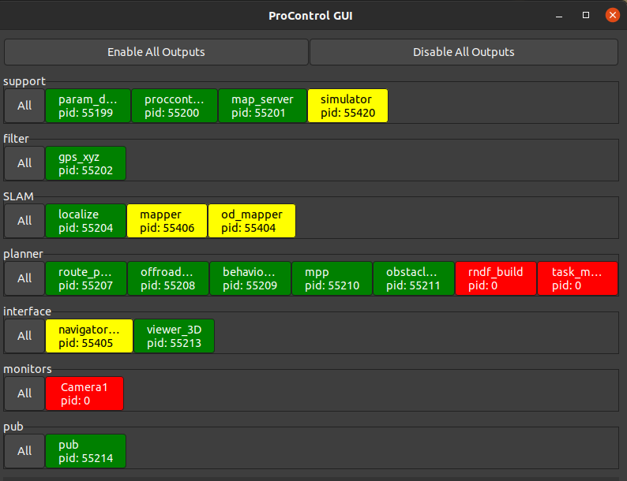
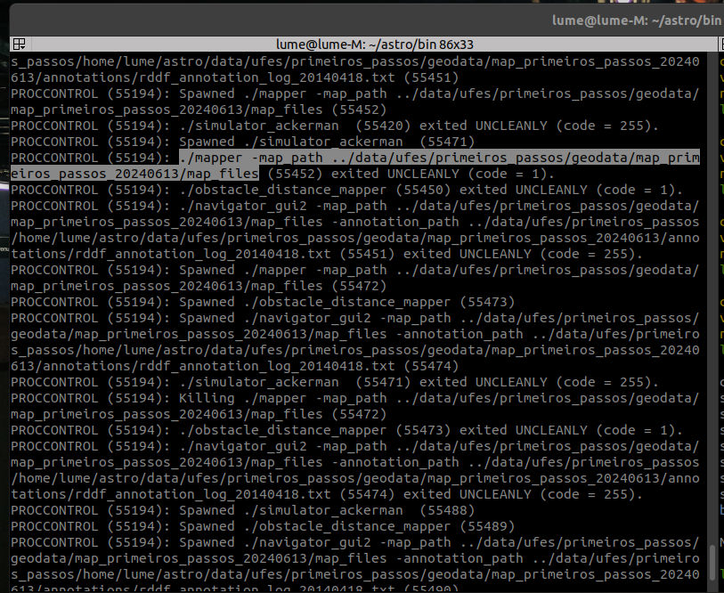
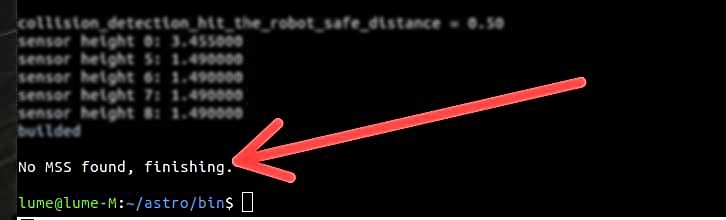
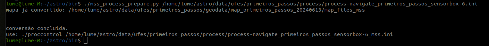

# Simulator Mode (or Navigate Mode)

 <p>Esse documento tem como função auxiliar na utilização do Simulator Mode (Navigate).</p>
 
 <p>O Navigate é um simulador da execução de um trajeto realizado por um veículo autônomo. Nele é possível estabelecer as condições que estarão presentes, como posição inicial do veículo, destino e obstáculos, além de testar mapas e a localização do veículo.</p>

 *******
**Tables of contents**

- [Simulator Mode (or Navigate Mode)](#simulator-mode-or-navigate-mode)
	- [Primeiros passos](#primeiros-passos)
	- [Proccontrol GUI](#proccontrol-gui)
	- [Utilizando o Simulador de Objetos Móveis no Navigate](#utilizando-o-simulador-de-objetos-móveis-no-navigate)
	- [Próximo Passo](#próximo-passo)

*******

<div id='primeirospassos'/>

## Primeiros passos

 Para iniciar o Navigate, é necessário estar dentro da pasta **/astro/bin** e executar o comando `./central` no terminal, que irá conectar ao servidor. Então, em outro terminal, também dentro da pasta **/astro/bin**, executar o comando `./proccontrol <arquivo>`, onde o nome do arquivo deve ser o trajeto que se deseja realizar, por exemplo `./process-navigate_primeiros_passos_sensorbox-6.ini`.

 O *Proccontrol* executa diversos programas na linha de comando, que quando estão rodando ao mesmo tempo irão gerar o que é visto como o *Navigate*. Também será gerada uma interface gráfica, o *Proccontrol gui* onde é possível ver os programas em execução.

 <p align="center">
  
</p> 
<div id='proccontrolGUI'/>

## Comandos utilizados
```bash
    ./central
    ./proccontrol /home/lume/astro/data/ufes/primeiros_passos/process/process-navigate_primeiros_passos_sensorbox-6.ini
```


> [!NOTE]
> ALTERAÇÃO REALIZADA AQUI!
## Erro na execução do Process

O print abaixo mostra em amarelo os módulos que não foram executados:

<p align="center">
  
</p>

Para identificar o erro de execução é necessário parar o processo que deu erro clicando com o botão esquerdo do mouse em cima dele e selecionar a opção stop. Depois vá ao terminal onde está sendo executando o ./proccontrol para verificar o log do erro (exited UNCLEANLY).

<p align="center">
  
</p>
Nesse log você consegue visualizar qual foi o módulo que não foi executado, como por exemplo o mapper:

```bash
./mapper -map_path ../data/ufes/primeiros_passos/geodata/map_primeiros_passos_20240613/map_files
```
Para encontrar qual foi o motivo do erro acima copie a linha de erro, abra outro terminal e execute-o na pasta astro/bin.
  
**Obs.:** O *./central* ainda precisa estar em execução

<p align="center">
  
</p>

Como resultado verifica-se que que o módulo mss não foi encontrado. Por causa de uma atualização nos mapas do astro esse módulo se tornou obrigatório para que os mapas sejam carregados. Para corrigir, execute o comando abaixo para que ocorra a conversão.

```bash
./mss_process_prepare.py <caminho para o seu process>
```
Caso a mensagem abaixo tenha sido apresentada a conversão foi um sucesso. Agora execute novamente o novo Process gerado,o simulador deve abrir:
<p align="center">
  
</p>

Dica: Toda vez que um arquivo do *process* não é executado, utilize esse método para descobrir a razão. Um erro comum de acontecer é o caminho das variáveis do Process estarem errados ou não existir mais os arquivos no local.

## Proccontrol GUI

 Dentro do *Proccontrol gui*, os programas que estão rodando ficam em verde, os que estão com erro/reiniciados em amarelo e os que não estão mais sendo executados em vermelho. Clicando em cada um, é possível realizar funções como iniciá-los ou pará-los. No *viewer_3D*, é possível visualizar o ambiente com 3 dimensões sem os dados dos sensores (que são captados no mundo real), e também visualizar outras características clicando em *options*. 

<p align="center">
  
</p>

<div id='utilizando-o-navigate' />

## Utilizando o Simulador de Objetos Móveis no Navigate

 Para realizar o trajeto, deve inserir o veículo no mapa, clicando em *Place Robot*, marcar o destino com *Place Final Goal* e clicar em *Compute Route* para que sejam calculadas as possíveis rotas que o veículo seguirá, sendo a linha azul no meio a menor rota, a qual terá preferência. Clicando em *Go* o percurso é iniciado, e aparecerá o retângulo amarelo, que representa a próxima posição que o veículo deverá buscar, que irá sendo atualizada até o fim do percurso.

 Na parte lateral também é possível visualizar o painel do veículo, contendo o volante, sua inclinação, o pedal e a velocidade. No topo há algumas ações que podem ser realizadas, como:

* Em *Maps*, trocar o tipo de mapa que se vê, por exemplo para *Costs*, que mostra uma visualização com maior foco nos obstáculo com pontos pretos.
* Em *Display* são mostradas algumas características como por exemplo em *Collision Model*, que mostra a área de colisão do veículo.
* Já na aba *Simulator* é possível inserir no mapa outros objetos, como carros, bicicletas ou pessoas e também removê-los. É possível ver mais sobre em [Moving Objects Simulation](../moving_objects_simulation/moving_objects_simulation.md).

O que o *Simulator Mode* realiza é replicar as condições que ocorrem no mundo real - como características do veículo, aceleração e mapa - para dentro do programa, para que seja possível simular e testar um veículo autônomo em execução dentro de um ambiente controlado.

<p align="center">
  
</p>

## Próximo Passo

Agora que você entendeu como funciona o modo **Simulator Mode**, siga nesse [tutorial](../playback/playback.md) ver o funcionamento do modo **Playback**.
